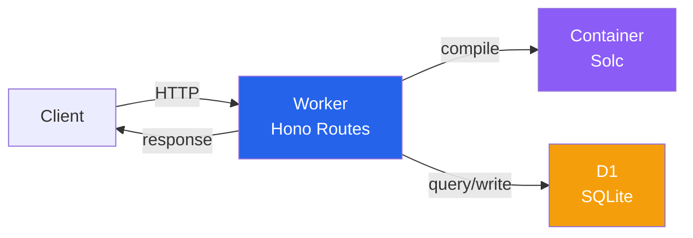

# Tempo Contract Verification Service

[contracts.tempo.xyz/docs](https://contracts.tempo.xyz/docs)

Sourcify-compatible smart contract verification service. Currently supports Tempo Testnets and Devnets.

## Architecture



## API Endpoints

### Verification

- `POST /v2/verify/:chainId/:address` - Verify contract with source code
- `GET /v2/verify/:verificationId` - Check verification status

### Lookup

- `GET /v2/contract/:chainId/:address` - Get verified contract details
- `GET /v2/contract/all-chains/:address` - Find contract across all chains
- `GET /v2/contracts/:chainId` - List all verified contracts on a chain

### Usage

#### With [Foundry](https://getfoundry.sh)

Pass the API URL to the `--verifier-url` flag and set `--verifier` to `sourcify`:

```bash
forge script script/Mail.s.sol --verifier-url https://contracts.tempo.xyz --verifier sourcify
```

See [/apps/contract-verification/scripts/verify-solidity.sh](./scripts/verify-solidity.sh)
and [/apps/contract-verification/scripts/verify-vyper.sh](./scripts/verify-vyper.sh) for small examples you can run.

#### Direct API Usage

- Standard JSON: see [/apps/contract-verification/scripts/verify-via-curl.sh](./scripts/verify-via-curl.sh) for a full example.

### Development

#### Prerequisites

- A container runtime (e.g., [OrbStack](https://docs.orbstack.dev), [Colima](https://github.com/abiosoft/colima), Docker Desktop)

```sh
cp .env.example .env  # Copy example environment variables
pnpm install          # Install dependencies
pnpm dev              # Start development server
```

Once dev server is running, you can run scripts in the [/apps/contract-verification/scripts](./scripts) directory to populate your local database with verified contracts.

#### Database

We use [D1](https://developers.cloudflare.com/d1), a serverless SQLite-compatible database by Cloudflare.
For local development, keep migrations and seeding separate:

```bash
pnpm db:prepare:local  # Apply local D1 migrations non-interactively
pnpm db:seed:local     # Seed native/precompile contract metadata into local D1
```

For remote D1:

```bash
pnpm db:prepare:remote # Apply remote D1 migrations non-interactively
pnpm db:seed:remote    # Seed native/precompile contract metadata into remote D1
```

The seed script uses Wrangler's D1 binding path rather than opening the SQLite file directly, so the same seeding logic works for both local and remote D1.

`pnpm db:studio` uses the Drizzle D1 HTTP config. If you need to inspect the local SQLite file directly, resolve it with [local-d1.ts](./scripts/local-d1.ts) and point a SQLite-capable tool at that path instead.

| environment | database      | dialect | GUI                                                                 |
|-------------|---------------|---------|---------------------------------------------------------------------|
| production  | Cloudflare D1 | SQLite  | [DrizzleKit Studio](https://github.com/drizzle-team/drizzle-studio) |
| development | Local SQLite  | SQLite  | [local-d1.ts](./scripts/local-d1.ts) + your SQLite tool of choice   |
